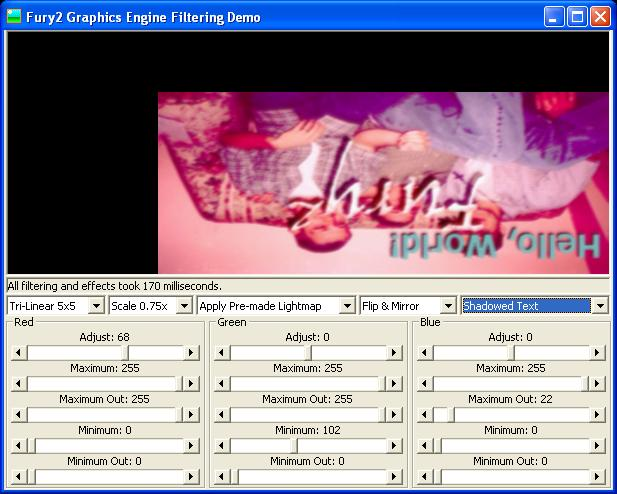

<div align="center">

## Color Adjustment/Scaling/Effects \- Fastest on PSC\!


</div>

### Description

Demonstrates performing dozens of graphical effects using the high-speed Fury2 Graphics Engine.
 
### More Info
 
Graphics data, and a few different parameters.

Fury2GE is designed similarly to GDI and DirectDraw, but without as many quirks. The C++ (F2SoftFX.dll) is still in beta, so you may get an occasional crash.

Altered graphics data

Saving lots of time by not having to write your own graphics code.


<span>             |<span>
---                |---
**Submitted On**   |
**By**             |[Kevin Gadd](https://github.com/Planet-Source-Code/PSCIndex/blob/master/ByAuthor/kevin-gadd.md)
**Level**          |Beginner
**User Rating**    |4.9 (88 globes from 18 users)
**Compatibility**  |VB 4\.0 \(32\-bit\), VB 5\.0, VB 6\.0, VB Script, ASP \(Active Server Pages\) 
**Category**       |[Graphics](https://github.com/Planet-Source-Code/PSCIndex/blob/master/ByCategory/graphics__1-46.md)
**World**          |[Visual Basic](https://github.com/Planet-Source-Code/PSCIndex/blob/master/ByWorld/visual-basic.md)
**Archive File**   |[](https://github.com/Planet-Source-Code/kevin-gadd-color-adjustment-scaling-effects-fastest-on-psc__1-28527/archive/master.zip)


### Source Code

```
PSC wouldn't upload, so get it here:
http://www.rpgmaker.net/janus/Filtering.zip
```

